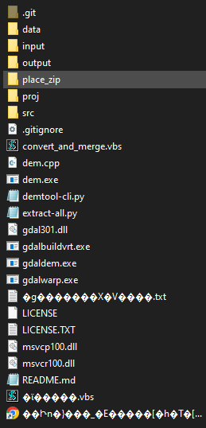

# DEMTOOL-CLI

Run [demtool](https://github.com/tmizu23/demtool) from command line instead of GUI.

## How to install

1. Download [this repo](https://github.com/Thibb1/demtool-cli/archive/master.zip) and [demtool](http://www.ecoris.co.jp/contents/demtool.html) and extract them.
2. Put contents of demtool-cli in the demtool folder.

## How to use

1. Get map data from [here (jp)](https://fgd.gsi.go.jp/download/menu.php) use translate to register and to get the `Digital elevation model` of your choice. Download it and move it to the `place_zip` folder.
2. Run `python extract-all.py` to extract the zip file data into the `input` folder.
3. Run `python demtool-cli.py` to run demtool. The output will be in the `output` folder.